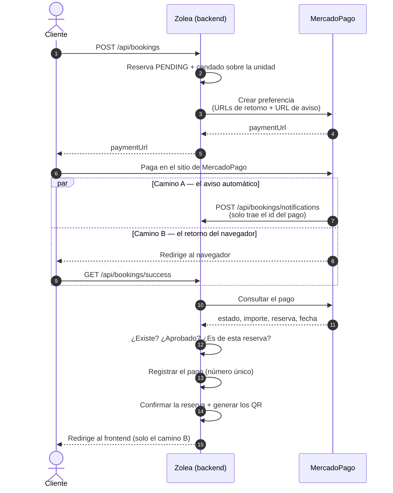

# Flujo de pago

Cómo se cobra una reserva y cómo se confirma, con los dos caminos que existen y por qué son
dos.

La regla que ordena todo el flujo: **nada se confirma por lo que diga una URL.** Lo que llega
por HTTP es apenas un número de pago; el estado real se le pregunta a MercadoPago.

---

## El recorrido completo



## Paso a paso

1. **El cliente reserva.** El backend guarda la reserva como `PENDING`, le pide a MercadoPago
   un link de pago y se lo devuelve. En ese mismo pedido le declara las tres URLs de retorno
   (éxito, pendiente, fallo) **y la URL del aviso automático** (`notificationUrl`). Sin esa
   última no hay aviso y el camino A no existe.
2. **El cliente paga** en el sitio de MercadoPago. El backend no ve datos de la tarjeta.
3. **La confirmación llega por dos caminos independientes**, y con cualquiera alcanza:
   - **Camino A, el aviso automático** (*webhook* o *IPN*): los servidores de MercadoPago
     llaman a `POST /api/bookings/notifications` apenas el pago cambia de estado. No hay
     navegador de por medio, así que funciona aunque el cliente cierre la pestaña.
   - **Camino B, el retorno:** el navegador del cliente vuelve a `GET /api/bookings/success`.
4. **Los dos consultan el pago contra MercadoPago** antes de tocar nada, y comprueban lo
   mismo: que el pago **exista**, que esté **aprobado** y que sea **de esa reserva**.
5. **Se registra el cobro** en `payment` —número, importe, fecha de acreditación y fecha de
   registro— y recién entonces se confirma la reserva y se generan los códigos QR.
6. **En el balneario** se valida el QR, o el DNI si el cliente no lo tiene a mano.

---

## Las decisiones que no se ven en el diagrama

**Por qué hay dos caminos.** El aviso solo se pierde si la pasarela está caída justo en ese
momento; el retorno, si el cliente cierra la pestaña. Que fallen los dos a la vez es bastante
menos probable que cualquiera de las dos cosas por separado. Como **ninguno de los dos
confirma sin preguntar**, tener dos no agrega riesgo: agrega una segunda oportunidad.

**Por qué los dos endpoints son públicos.** Quien los llama es MercadoPago —sus servidores en
el camino A, el navegador que vuelve de su sitio en el camino B— y ninguno de los dos tiene el
token de la aplicación. Que sean públicos es seguro justamente porque no le creen a lo que les
llega.

**Por qué el retorno comprueba una cosa más.** En el camino B el número de reserva viene en la
URL, que la escribe el navegador: hay que verificar que el pago sea realmente de esa reserva.
Sin esa comprobación alcanzaría con reutilizar el comprobante de cualquier pago aprobado
—uno propio, de una reserva de $1— para confirmar otra. En el camino A **no llega ningún
número de reserva**: se toma el del propio pago, que lo informa la pasarela. No hay nada que
comparar porque no hay nada que el que avisa haya podido elegir.

**Por qué el aviso responde siempre 200, incluso cuando no confirma.** Un código de error hace
que MercadoPago reintente, y reintentar no arregla un aviso de un pago rechazado ni uno que no
es de un pago: solo genera ruido. La contrapartida conocida es que si la pasarela está caída
justo en ese momento, ese aviso se pierde — y ahí queda el camino B.

**Por qué el registro va antes de la confirmación.** Es lo que hace que dos avisos
**simultáneos** no generen dos juegos de códigos QR. Está explicado en
[decisiones.md](decisiones.md#8-el-pago-se-registra-antes-de-confirmar-la-reserva).

---

## Probarlo en una máquina de desarrollo

MercadoPago necesita una dirección pública HTTPS a la que llamar, y `localhost` no lo es. La
solución en local es un túnel:

```bash
ngrok http 8080
```

y poner esa dirección en `NGROK_BASE_URL` dentro del `.env`. Con eso, las URLs de retorno y la
del aviso se arman solas.

**Sin ngrok igual se puede probar el flujo entero**: las pruebas automáticas
(`VerifiedPaymentTest`, `PaymentNotificationTest`, `PaymentRecordTest`) sustituyen la pasarela
por una implementación de mentira y no necesitan red. Eso es exactamente para lo que existe la
interfaz `PaymentGateway`.
