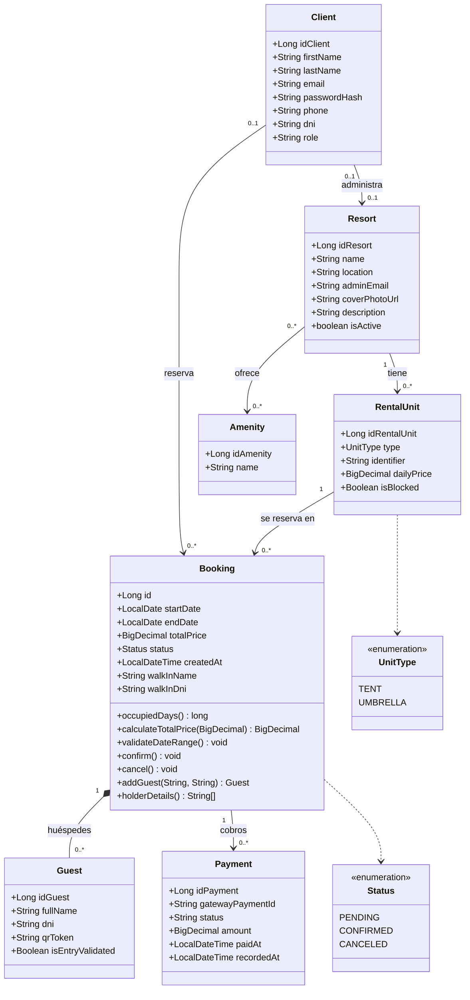
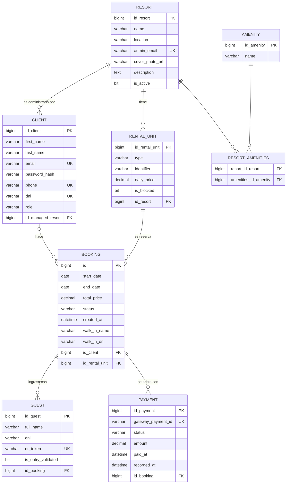

# Modelo de datos

Dos vistas del mismo modelo: el **diagrama de clases**, que es cómo lo ve el código Java, y
el **diagrama entidad-relación**, que es cómo queda en MySQL. Los dos están escritos en
Mermaid, así que GitHub los dibuja solo.

Las tablas las genera Hibernate a partir de las entidades (`spring.jpa.hibernate.ddl-auto`),
no hay scripts de esquema escritos a mano. Lo que se ve acá es lo que hay en la base: se
verificó contra `zolea_db` con `SHOW CREATE TABLE`.

---

## Diagrama de clases

**Cómo leer las relaciones que no son obvias:**

- **`Client` → `Resort`** es la relación administrador↔balneario. Vive en `Client` porque un
  administrador gestiona un solo balneario, pero un balneario puede tener varios
  administradores. Un cliente común la tiene en `null`.
- **`Booking` → `Guest` es una composición** (el rombo lleno). Los huéspedes no existen fuera
  de su reserva: se crean con ella y se borran con ella (`cascade = ALL`,
  `orphanRemoval = true`). Antes de declararlo así, borrar una reserva dejaba códigos QR
  huérfanos que seguían siendo válidos.
- **`Booking.client` es opcional.** Una reserva de mostrador la carga un administrador para
  alguien que no tiene cuenta: el titular viaja en `walkInName` / `walkInDni`.
- **`Booking` → `Payment`** es de uno a varios y no de uno a uno, porque un cobro que falla y
  se reintenta genera un pago nuevo. De cada pago de la pasarela queda una sola fila:
  `gatewayPaymentId` es único.

**Los métodos que se listan son solo los de `Booking`,** y están ahí porque son el punto del
modelo donde viven las reglas del negocio: cuántos días ocupa una reserva, cuánto sale, qué
rangos de fecha son válidos y a qué estados puede pasar. Las demás entidades son datos.

---

## Diagrama entidad-relación

### Restricciones de unicidad

Son las reglas que hace cumplir la base, no el código. La diferencia importa: un chequeo
previo en el servicio lo pasan dos peticiones simultáneas, una restricción de la base no.

| Tabla | Restricción | Qué impide |
|---|---|---|
| `client` | `email` único | Dos cuentas con el mismo email |
| `client` | `uk_cliente_telefono` | Dos cuentas con el mismo teléfono |
| `client` | `dni` único | Dos cuentas con el mismo DNI |
| `resort` | `admin_email` único | Dos balnearios con el mismo administrador |
| `rental_unit` | `uk_unidad_por_balneario` (`id_resort`, `identifier`) | Dos carpas «A-01» en el mismo balneario |
| `guest` | `qr_token` único | Dos huéspedes con el mismo código QR |
| `payment` | `uk_pago_de_pasarela` (`gateway_payment_id`) | Que un mismo pago de MercadoPago deje dos filas — y con ellas dos juegos de códigos QR |

La última es la que sostiene el cobro: MercadoPago reintenta sus avisos, y dos que lleguen
exactamente a la vez leerían los dos la reserva como pendiente. La explicación completa está
en [decisiones.md](decisiones.md#8-el-pago-se-registra-antes-de-confirmar-la-reserva).

### Lo que no está en la base

- **No hay tabla de usuarios aparte:** `client` es la única. El rol es una columna
  (`role`), con los valores `USER` y `ADMIN`.
- **No hay tabla de sesiones ni de tokens:** la autenticación es JWT sin estado.
- **El esquema no está versionado con Flyway.** Lo genera Hibernate. Ver la decisión 9.
